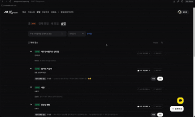

# SOPT Crew Product 

> SOPT 구성원들이 하나로 모일 수 있는 모임 서비스

이 저장소는 여러 앱과 공통 패키지를 함께 관리하는 모노레포입니다. 이 README의 서비스 소개와 개발 안내, 기술 스택은 **CREW 앱(`apps/crew`)에만 해당합니다.**


## 모임

함께하고 싶은 모임을 찾는 것부터, 참여한 모임의 이야기를 나누는 것까지. Playground의 모임 공간을 소개합니다.

### 홈: 이런 모임, 열리면 좋겠어요

멤버들이 기다리는 모임을 둘러봅니다. 마음에 드는 제안을 발견했다면 관심을 표현하고, 찾는 모임이 없다면 직접 원하는 모임을 제안할 수 있어요. 아래로 내려가면 참여한 모임과 피드로도 이어집니다.


### 전체 모임: 나에게 맞는 모임 찾기

모임 카드를 훑어보며 모집 현황과 활동 정보를 살펴봅니다. 목록을 둘러보다가 카테고리 등 원하는 조건을 고르면 관심 있는 모임을 더 쉽게 찾을 수 있어요.


### 내 모임: 참여한 뒤의 이야기도 한곳에서

신청한 모임과 직접 만든 모임을 오가며 활동을 확인합니다. 모임 상세에서는 안내를 읽고 `피드` 탭으로 넘어가 멤버들이 남긴 소식과 후기도 볼 수 있어요.


### 솝맵: 다음 만남의 장소 찾기

멤버들이 추천한 장소를 둘러보고, 카테고리와 주변 역을 기준으로 찾아봅니다. 마음에 드는 장소를 확인하거나 내가 아는 좋은 장소를 직접 등록할 수도 있어요.



## Getting Started

아래 명령어는 저장소 루트에서 실행합니다.

### 1. node_modules 설치

```sh
yarn
```

### 2. 환경변수 등록

`apps/crew/.env.sample` 파일 이름을 `apps/crew/.env.local`로 변경하고, 내용을 채워주세요. `.env.local` 에 필요한 내용은 동료 개발자로부터 얻을 수 있어요.

### 3. API 코드 제너레이션

```sh
yarn workspace crew api:generate-types
```

OpenAPI 스키마는 Crew API v2 문서에서 생성하며, 생성된 파일은 직접 수정하지 않습니다.

| 명령어 | 설명 | 생성 파일 |
| --- | --- | --- |
| `yarn workspace crew api:generate-types` | Crew API v2 스키마 생성 | `apps/crew/src/__generated__/schema.d.ts` |

### 4. 개발 서버 실행

```sh
yarn dev:crew
```

## 🔍 프로젝트 배경

모임 서비스는 SOPT 구성원들이 하나로 모일 수 있는 순간을 제공하고, SOPT 내 존재하는 다양한 모임들을 보다 활성화하기 위해 탄생했어요.

## 🛠️ 기술 스택

- TypeScript, React, Next.js
- React Context, TanStack Query, React Hook Form
- Stitches
- GitHub Actions
